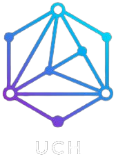

# UrbanClapXHuddle

## Description 

A decentralised web service that allows consumers to pay MATIC consultants' fees to communicate with employees like plumbers, carpenters, electricians, etc. via one-on-one video calls utilising Huddle01. The frontend was created using ReactJs and TailwindCSS, and the smart contract was deployed on the Polygon Mumbai Testnet. If a user is a worker, he or she can register on the site as a worker and adjust when his presence is available for consulting. The UrbanClapXHuddle uses Huddle01's Iframe to conduct the video call.

## Brief Details

We considered creating something that would be useful to users all around the world.

The smart contract that holds the structs for the "User" , "Worker" and "Appointment" was created using Solidity, while the front end was created using Vite with TailwindCSS. For the many websites of the Dapp, we created a number of components. Every worker in the smart contract has a unique meeting link that was allocated to them. These meeting links were produced using the npm package "random-string" while the user was registering as a worker.

Wagmi was utilised for the many hooks it offers, while Rainbowkit handled the wallet connection.

## Backend

### Smart Contract Details

Smart Contract Code: [UrbanClapXHuddle](https://github.com/priyaraval12/UrbanClapXHuddle/blob/main/src/contracts/UrbanClapXHuddle.sol )

### Smart Contract Deployment
The smart contract has been deployed on the Polygon Mumbai Testnet.
Smart Contract Address: <b>0xaCeaba4b6327EA6b0f5a0B41302840DDAb2Cc037</b>

 

## Frontend

For the design and build, we have used React.js and TailwindCSS

All the frontend code is available under [/src](https://github.com/priyaraval12/UrbanClapXHuddle/tree/main/src).

